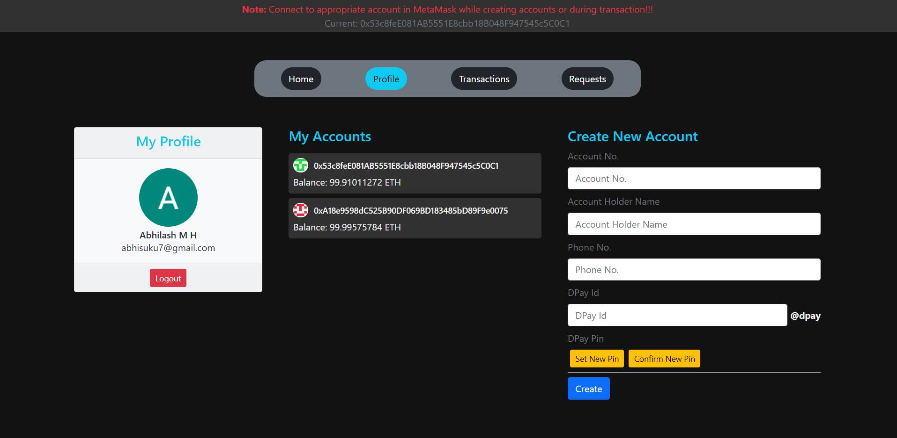
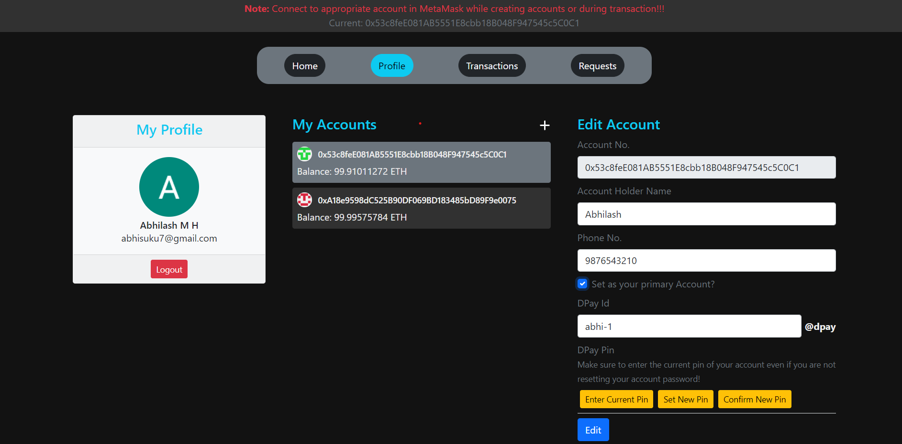
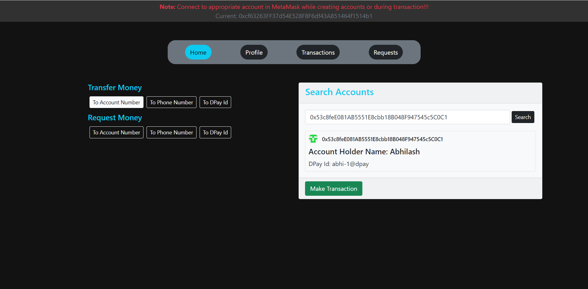
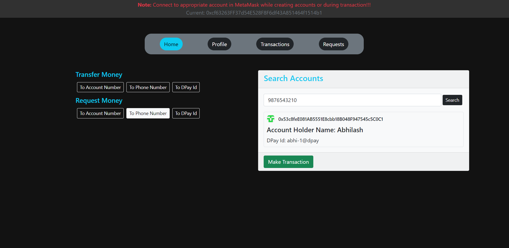
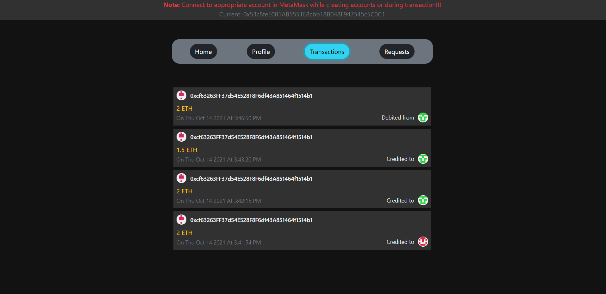
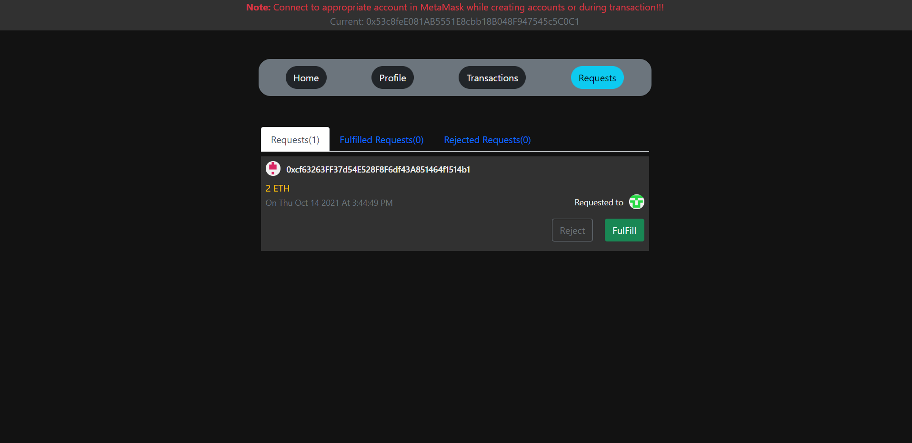
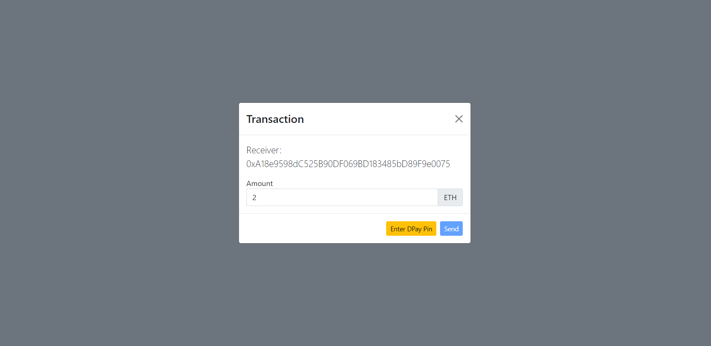

# DApp Pay

> > Decentralized Payment App(PhonePe clone)

### Technologies

`React` `Solidity` `Truffle` `Web3.js`

### Features

- Create / Edit Accounts
- Send / Request Amount (Transactions) via account no., phone no. and DPay ID
- Fulfill / Reject Requested Amount
- Lists transaction history

### Screenshots

#1 #2 Profile(Accounts) | #3 #4 Search account(and made necessary transaction-send/request amount) | #5 Transaction History | #6 Request Amount Section | #7 Transaction modal

